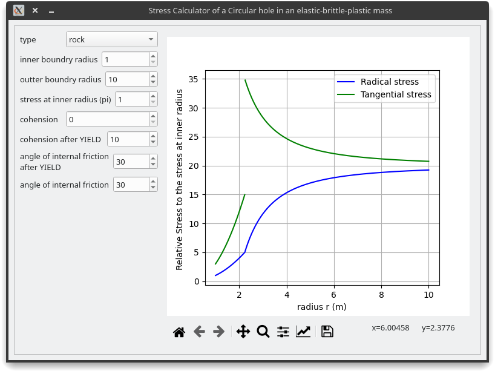
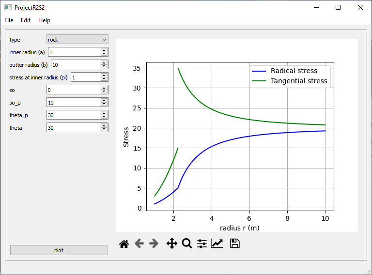

# Stress calculator of a Circular hole in an elastic-brittle-plastic mass

Some code written during early 2020.

Ref:

Fundamentals of Rock Mechanics, Jaeger, J.C Cook, N.G.W,Published by Methuen & Co (1969)

For the circular hole in an elastic-brittle-plastic rock mass, the stress solution is given on pages 257-260 of Jaeger, Cook and Zimmerman (this solution can be found elsewhere as well).  Code this solution so that the tangential and radial stresses can be plotted for any reasonable set of strength parameters, and for any radius (not only vertical and horizontal principal radii.). 

<https://colab.research.google.com/drive/15PjQCCI6qSeTFk1oD5UHbvSASNPfkllT#scrollTo=167lR_PaoJY1>

<https://gist.github.com/shenlebantongying/50b95a2a3d2e21a4064548c958677c3e>

Built with Pyside2 (Qt 5.15).

